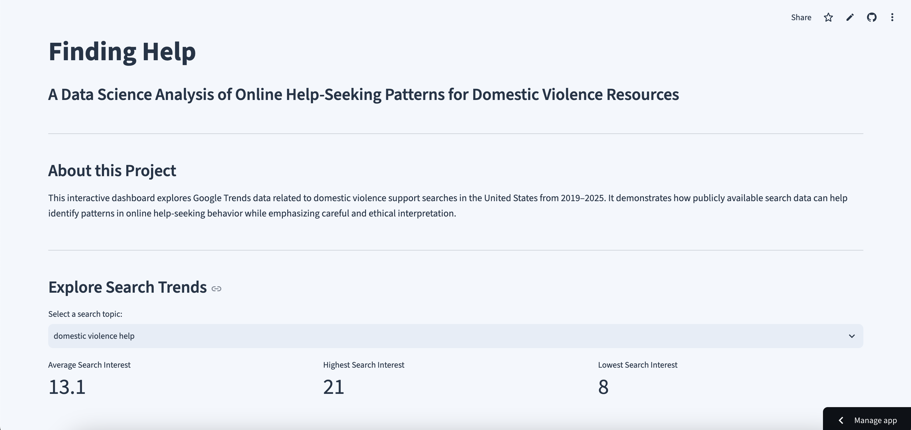

# Finding Help

*A data science project analyzing online help-seeking patterns for domestic violence resources using public search data.*
---

## Project Overview

Finding Help is a data science project that analyzes Google Trends search data to explore patterns in online help-seeking behavior related to domestic violence support resources in the United States.

Using publicly available search interest data from 2019–2025, this project investigates how search behavior changes over time and demonstrates how data science can be used to better understand awareness and help-seeking trends while emphasizing ethical interpretation.

---

## Research Question

**How have online search patterns for domestic violence support resources changed over time, and what insights can public search data provide about help-seeking behavior and resource awareness?**

---

## Live Dashboard

The interactive Streamlit dashboard allows users to explore the project findings through interactive visualizations and summary statistics.

Features include:

- Interactive topic selection
- Google Trends visualizations
- Summary metrics
- Long-term trend analysis
- Key findings and interpretation
- Links to domestic violence support resources

** Live App:** https://finding-insights.streamlit.app/

---

## Dashboard Preview


---

## Project Workflow

This project follows a complete data science workflow, from collecting public search data to building an interactive dashboard for exploring the results.

### Notebook 1 – Data Collection

Collected monthly Google Trends data (2019–2025) for multiple domestic violence support-related search terms using the Pytrends library.

---

### Notebook 2 – Data Cleaning

Prepared the dataset by checking for missing values, removing unnecessary columns, verifying data quality, and exporting cleaned data for analysis.

---

### Notebook 3 – Exploratory Data Analysis

Created visualizations to identify trends, compare search topics, and explore long-term changes in search interest.

---

### Notebook 4 – Discussion & Implications

Interpreted findings, discussed ethical considerations, identified project limitations, and explored how public search data can inform awareness and future research.

---

## Repository Structure

```text
finding-help-data-science/
│
├── dashboard/
│   └── app.py
│
├── notebooks/
│   ├── 01_data_collection.ipynb
│   ├── 02_data_cleaning.ipynb
│   ├── 03_exploratory_analysis.ipynb
│   └── 04_discussion_and_implications.ipynb
│
├── data/
├── visualizations/
├── src/
├── docs/
├── .streamlit/
├── requirements.txt
├── README.md
└── LICENSE
```

---

## Tools & Libraries

- Python
- Pandas
- Matplotlib
- Seaborn
- Plotly
- Streamlit
- Pytrends
- Git
- GitHub
- Jupyter Notebook
- VS Code

---

## Key Findings

- Emotional abuse had the highest average Google search interest across the study period.
- Domestic violence help showed the largest long-term increase from 2019 to 2025.
- Different search topics followed different patterns over time rather than changing together consistently.
- Search interest remained relatively stable throughout the year, with little evidence of strong seasonality.
- Public search data can provide insight into online help-seeking behavior but should not be interpreted as a measure of real-world domestic violence incidents.

---

## Data Source

Google Trends

Search topics analyzed include:

- Domestic Violence Help
- Abuse Hotline
- Women's Shelter
- Emotional Abuse
- Teen Dating Violence

---

## Ethical Considerations

This project analyzes publicly available, aggregated Google Trends data.

No personally identifiable information was collected or analyzed.

The goal of this project is to demonstrate ethical applications of data science while recognizing the limitations of search interest as a proxy for real-world behavior.

---

## Resources

- National Domestic Violence Hotline
- Love Is Respect
- RAINN

---

## How to Run This Project

The interactive dashboard is available online:

** https://finding-insights.streamlit.app/**

To run the project locally:

1. Clone the repository:

```bash
git clone https://github.com/seryuiroke/finding-help-data-science.git
```

2. Install the required libraries:

```bash
pip install -r requirements.txt
```

3. The notebooks should be run in the following order to reproduce the analysis:

```text
01_data_collection.ipynb
02_data_cleaning.ipynb
03_exploratory_analysis.ipynb
04_discussion_and_implications.ipynb
```

4. (Optional) Launch the Streamlit dashboard locally:

```bash
streamlit run dashboard/app.py
```
----

## Author

Shraddha Rao

Summer 2026

This project was created for educational purposes using publicly available Google Trends data.